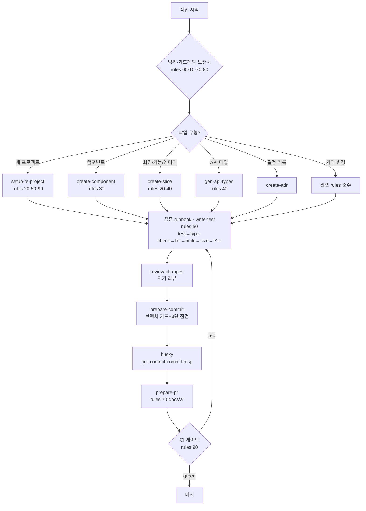

# 개발 워크플로 오케스트레이터

"매번 규칙을 다 찾아볼 수 없다" → **여기서 시작한다.** 작업 유형만 정하면 읽을 규칙과 실행할
스킬, 검증·커밋·PR·CI까지 표준 경로로 안내한다. 규칙 전문은 `claude/rules/`, 상세 지도는
`claude/README.md`.

## 0. 항상 먼저 (모든 작업 공통)

1. **프레임워크 확인** — 이 프로젝트가 **Vue인지 React인지** 확인한다(모르면 묻는다). 프레임워크
   특화 규칙은 `rules/vue/*` 또는 `rules/react/*`에서 읽는다. 공통 규칙(`rules/*.md`)은 둘 다 동일.
2. **범위 확인** — 요청이 모호하거나 3파일+/설정·구조·비가역 변경이면 착수 전 한 줄로 확인
   (`rules/05-working-with-claude.md`). 크거나 모호하면 코드보다 **`plan-feature`로 계획 먼저**(`rules/15`).
3. **가드레일 인지** — 임의 패키지/설정 변경·범위 밖 리팩터링·시크릿 하드코딩 금지
   (`rules/10-guardrails.md`, `rules/80-security-and-secrets.md`).
4. **브랜치 확인** — 보호 브랜치(main/develop\*)면 feature 브랜치부터 (`rules/70-git-and-reviews.md`).

## 1. 작업 유형 → 라우팅

| 하려는 것                            | 읽을 규칙                 | 실행 스킬                      |
| ------------------------------------ | ------------------------- | ------------------------------ |
| 큰·모호한 작업(3파일+/구조/비가역)   | 05, 15                    | **plan-feature**               |
| 새 프로젝트/모노레포 부트스트랩      | 20, 50, 90                | **setup-fe-project**           |
| UI 컴포넌트 추가                     | `<fw>`/code-style, 35     | **create-component**           |
| Figma 디자인 구현                    | 37, `<fw>`/code-style     | **implement-from-figma**       |
| 화면(page)/기능(feature)/엔티티 추가 | 20, `<fw>`/state-and-data | **create-slice**               |
| 서버 API 연동/타입 생성              | 40, `<fw>`/state-and-data | **gen-api-types**              |
| 디자인 토큰 재생성(Token Studio)     | `<fw>`/code-style         | **gen-tokens**                 |
| 테스트 작성(단위·통합·E2E)           | 50                        | **write-test**                 |
| 버그 조사·수정                       | 10, 50                    | **debug-issue**                |
| 아키텍처/도구 결정 기록              | —                         | **create-adr**                 |
| 에러 처리/토스트                     | `<fw>`/error-handling     | (docs/ai/error-toast-template) |
| 변경 리뷰(자기 리뷰 포함)            | 전체                      | **review-changes**             |
| 커밋                                 | 50, 70                    | **prepare-commit**             |
| PR 준비/올리기                       | 70                        | **prepare-pr**                 |
| 기타 코드 변경                       | 해당 rules                | — (규칙 준수 후 아래 검증)     |

`<fw>` = 프로젝트 프레임워크(`vue` 또는 `react`). 예: Vue면 `rules/vue/code-style`.

> **UI 작업이면 Figma부터 확인:** "참고할 Figma 디자인이 있나요?"를 먼저 묻는다. 있으면
> `implement-from-figma`, 없으면 `create-component`/`create-slice`. Figma 사용을 가정하지 않는다.

## 2. 작업 후 — 검증 (항상)

`rules/50-testing-quality.md`의 runbook 순서로:

```
pnpm run test → type-check → lint → build → size → (필요시) test:e2e
```

로직/파괴적 가드 변경엔 회귀 스펙 필수(`write-test`). 보고는 검증/미검증 영역 분리(`rules/05`).

## 3. 리뷰 → 커밋 → PR → CI

1. **review-changes** 스킬 — 커밋 전 자기 리뷰(경계·스펙·시크릿·중복 점검).
2. **prepare-commit** 스킬 — 브랜치 가드 + 관심사/중복/재사용 4단 점검 + 메시지.
3. **husky** 자동 발동 — pre-commit(lint-staged) + commit-msg(commitlint) (`rules/50`).
4. **prepare-pr** 스킬 — 검증 runbook + PR 설명 + 리뷰 포인트 (`rules/70`, `docs/ai`).
5. **CI** — verify + e2e 게이트가 green이어야 머지 (`rules/90`).

## 흐름 요약


